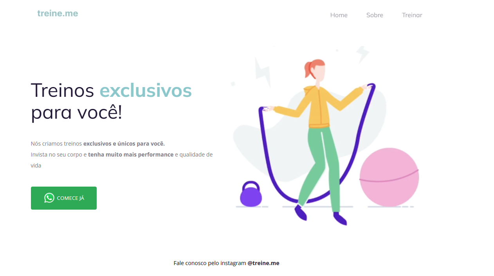

  

## 🖥️ Projeto

Esse é um projeto Web de uma aba de apresentação para um site de treino,para aprender alguns conceitos básicos de html e css.

## 👨‍💻 Tecnologias

Esse projeto foi desenvolvido com as seguintes tecnologias:

